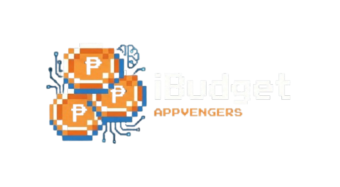

<div align="center">



**Smart Personal Finance Management Made Simple**

[](https://i-budget.site/)
[](https://github.com/PUP-BSIT/project-appvengers/actions/workflows/ci.yml)
[](https://github.com/PUP-BSIT/project-appvengers/actions/workflows/cd.yml)
[](https://github.com/PUP-BSIT/project-appvengers/actions/workflows/gitleaks.yml)
[](LICENSE)

[Live Demo](https://i-budget.site/) • [Documentation](documents/) • [API Docs](backend/appvengers/API_DOCUMENTATION.md) • [Report Bug](https://github.com/PUP-BSIT/project-appvengers/issues)

</div>

---

## 📖 About

**iBudget** is a modern web application designed to help people, especially students, manage their finances with ease. Built with cutting-edge technologies, it simplifies money management and reduces the time and effort typically associated with budgeting.

### 🎯 Problem Statement

Students and young professionals often struggle with:

- ❌ Overspending and financial stress
- ❌ Lack of visibility into spending habits
- ❌ Difficulty tracking daily, weekly, and monthly expenses
- ❌ No clear financial goals or budgets

### ✨ Our Solution

iBudget provides an intuitive, efficient platform to:

- ✅ Track all income and expenses in real-time
- ✅ Visualize spending patterns with interactive charts
- ✅ Set and achieve financial goals
- ✅ Receive smart notifications and insights
- ✅ Make informed financial decisions

---

## 🚀 Key Features

<table>
<tr>
<td width="50%">

### 💳 Transaction Management

Easily add, edit, and delete income and expense transactions with a clean, intuitive interface.

### 📊 Smart Categorization

Automatically categorize transactions to understand where your money goes.

### 🎯 Budget & Goal Setting

Set financial goals and create budgets with progress tracking.

### 🔔 Enhanced Notification System

- Urgency-based visual indicators (🔴 High, 🟡 Medium, 🟢 Low)
- Smart date grouping (Today, Yesterday, This Week)
- Filter tabs (All, Budgets, Savings, Unread)
- Real-time toast notifications via WebSocket

</td>
<td width="50%">

### 🤖 AI-Powered Bonzi Buddy Chatbot

- **Context-aware financial advice** - sees your actual data (income, expenses, and budgets)
- **Session memory** - remembers conversation context across multiple messages
- **Smart navigation** - creates "Add Transaction" buttons from natural language
- **Personalized insights** - gives advice based on your real financial data
- **RAG integration** - uses knowledge base for accurate iBudget guidance

### 📈 Visual Analytics

Interactive charts and graphs powered by Chart.js for deep insights.

### 🔒 Secure Account Management

Bank-level security with JWT authentication and rate limiting.

</td>
</tr>
</table>

---

## 🛠️ Tech Stack

### Frontend


- **Framework:** Angular 20 with Signals & Standalone Components
- **State Management:** RxJS + Angular Signals
- **UI Library:** Bootstrap 5 + Bootstrap Icons
- **Charts:** Chart.js + ng2-charts
- **HTTP Client:** Angular HttpClient with interceptors
- **Testing:** Jasmine + Karma + Playwright E2E
- **AI Integration:** microservice with Bonzi Buddy Chat
- **Real-time:** WebSocket for live notifications

### Backend


- **Framework:** Spring Boot 3.5.7
- **Language:** Java 21
- **Database:** MySQL 8.2
- **Security:** Spring Security + JWT Authentication
- **ORM:** Spring Data JPA + Hibernate
- **Validation:** Jakarta Bean Validation
- **Rate Limiting:** Bucket4j
- **Testing:** JUnit 5 + H2 Database
- **Code Coverage:** JaCoCo
- **Real-time:** WebSocket for live notifications
- **Email Service:** Spring Boot Mail for verification & notifications
- **AI Integration:** REST API for Bonzi Buddy chatbot
- **Context Services:** UserFinancialContext for AI data aggregation

### DevOps & Tools


- **CI/CD:** GitHub Actions (automated testing & security scans)
- **Secret Scanning:** Gitleaks
- **Build Tools:** Maven Wrapper, Angular CLI
- **Hosting:** Hostinger
- **Version Control:** Git & GitHub
- **E2E Testing:** Playwright for browser automation
- **AI Workflow:** seperate microservice for Bonzi Buddy chatbot automation
- **LazyGit** for terminal git TUI
- **RAG Database:** Pinecone for AI knowledge base
- **Environment Management:** Angular environment configs

---

## 🌐 Live Demo

🔗 **Production:** [https://i-budget.site/](https://i-budget.site/)

**Hosting:** Hostinger with MySQL database backend

### Test Account

- Email: <test@example.com>
- Password: password123

---

## 📦 Project Structure

```
project-appvengers/
├── frontend/ibudget/          # Angular 20 application
│   ├── src/app/               # Components, services, models
│   │   ├── chatbot-sidebar/   # AI chatbot integration
│   │   ├── notifications/     # Enhanced notification system
│   │   ├── transactions/      # Transaction management
│   │   ├── budgets/           # Budget tracking
│   │   ├── savings/           # Savings goals
│   │   └── dashboard/         # Analytics dashboard
│   ├── src/environments/      # Environment configurations
│   ├── src/services/          # Business logic services
│   ├── src/styles/            # Global SCSS styles
│   └── playwright-tests/      # E2E test suites
├── backend/appvengers/        # Spring Boot API
│   ├── src/main/java/         # Java source code
│   │   └── com.backend.appvengers/
│   │       ├── controller/    # REST controllers (incl. ChatbotController)
│   │       ├── service/       # Business logic (incl. ChatbotService, UserContextService)
│   │       ├── repository/    # Data access layer
│   │       ├── entity/        # JPA entities
│   │       ├── dto/           # Data transfer objects
│   │       ├── security/      # JWT & authentication
│   │       └── config/        # Spring & WebSocket config
│   └── src/test/              # Unit & integration tests
├── documents/                 # Comprehensive documentation
│   ├── markdown/              # Implementation guides
│   ├── microservice/          # microservice workflow configs
│   ├── sprints/               # Sprint planning docs
│   └── testcases/             # Test results & cases
├── coverage/                  # Code coverage reports
├── tasks/                     # Feature development tasks
└── .github/workflows/         # CI/CD pipelines
```


## 📚 Documentation

### Core Documentation

| Document | Description |
|----------|-------------|
| [API Documentation](backend/appvengers/API_DOCUMENTATION.md) | Complete REST API reference |
| [Integration Guide](backend/appvengers/INTEGRATION_GUIDE.md) | Frontend-Backend integration |
| [Quick Start Guide](backend/appvengers/QUICK_START.md) | Setup and deployment guide |
| [Environment Setup](documents/markdown/ENVIRONMENT_SETUP.md) | Environment configuration |
| [Code Coverage Guide](documents/markdown/CODE_COVERAGE_GUIDE.md) | Testing and coverage setup |

### AI & Chatbot Documentation

| Document | Description |
|----------|-------------|
| [Chatbot Implementation Guide](documents/markdown/CHATBOT_IMPLEMENTATION_GUIDE.md) | Bonzi Buddy context-aware AI system |
| [Smart Navigation Guide](#) | Deep linking from chatbot to app features |
| [AI Agent System Prompt](documents/markdown/iBudget_AI_Agent_System_Prompt.md) | Bonzi Buddy personality and behavior |
| [AI Knowledge Base](documents/markdown/iBudget_Knowledge_Base.md) | RAG information for AI assistance |

### Testing & Quality

| Document | Description |
|----------|-------------|
| [Chatbot Test Results](documents/testcases/Bonzi_Chatbot_Test_Results.md) | 100% compliance testing results |
| [E2E Authentication Tests](documents/testcases/E2E_Authentication_Test_Results.md) | End-to-end authentication flows |
| [Test Cases](documents/testcases/TEST_CASES.md) | Comprehensive test documentation |

### Development & Operations

| Document | Description |
|----------|-------------|
| [CI/CD Setup](documents/markdown/CI_CD_SETUP.md) | Continuous integration and deployment |
| [Communication Flow](documents/markdown/COMMUNICATION_FLOW_GUIDE.md) | Team development workflow |
| [SSH Key Fix](documents/markdown/SSH_KEY_FIX.md) | SSH configuration for deployment |

---

## 🤖 AI-Powered Features

### Bonzi Buddy - Your Financial AI Assistant

**Meet Bonzi Buddy** - An intelligent chatbot that understands your actual financial situation and provides personalized advice.

#### Key Capabilities

- **Context-Aware:** Sees your real income, expenses, budgets, and savings goals
- **Session Memory:** Remembers conversation context across multiple messages
- **Smart Navigation:** Creates "Add Transaction" buttons from natural language
- **Personalized Advice:** Gives recommendations based on your actual financial data
- **Knowledge Base:** Uses RAG (Retrieval-Augmented Generation) for accurate iBudget guidance

#### Examples

**User:** *"I spent 500 pesos on groceries at SM yesterday"*

**Bonzi:** *"Got it! I've prepared a transaction entry for you. Just review the details and click the button below to add it to your records.*

- **Amount:** ₱500
- **Category:** Groceries
- **Description:** Groceries at SM
- **Date:** 2024-12-17

[ACTION:navigate:/transactions?amount=500&category=Groceries&description=Groceries at SM&type=expense&date=2024-12-17&openModal=true]*

#### Technical Architecture

```
User Browser → iBudget App → Backend Server → microservice AI → Pinecone RAG → AI Response
```

- **Frontend:** Angular chat widget with microservice integration
- **Backend:** Spring Boot REST API with UserContextService
- **AI:**  workflow with custom system prompt and AI agent with memory database
- **RAG:** Pinecone vector database for knowledge retrieval

#### Testing Results

- **100% Compliance** with system prompt requirements
- **7/7 Tests Passed** covering identity, knowledge base, security, and behavior
- **Production Ready** with full privacy and security compliance

See [Chatbot Test Results](documents/testcases/Bonzi_Chatbot_Test_Results.md) for details.

---

## 🔒 Security

- **🔐 JWT Authentication:** Secure token-based authentication with refresh tokens
- **🛡️ Spring Security:** Role-based access control and CORS protection
- **⏱️ Rate Limiting:** Bucket4j for brute-force protection on login endpoints
- **🔍 Secret Scanning:** Automated Gitleaks checks via GitHub Actions
- **✅ Input Validation:** Jakarta Bean Validation on all API endpoints
- **🔄 CORS Protection:** Configured for production environment
- **📧 Email Security:** Secure email verification with temporary tokens
- **🔒 Account Management:** Secure password reset and account deactivation
- **📧 Email Security:** Secure email verification with temporary tokens
- **🔒 Account Management:** Secure password reset and account deactivation

---

## 🔔 Enhanced Notification System

Our notification system has been significantly improved with smart, user-friendly features:

### Smart Visual Indicators

- **🔴 High Priority:** Urgent deadlines, budget exceeded
- **🟡 Medium Priority:** Budget warnings, upcoming deadlines  
- **🟢 Low Priority:** Informational updates, general reminders

### Intelligent Organization

- **Date Grouping:** Automatically groups notifications by "Today", "Yesterday", "This Week"
- **Smart Filtering:** Filter tabs for "All", "Budgets", "Savings", "Unread"
- **Real-time Updates:** WebSocket-powered live notifications

### User Experience Enhancements

- **Toast Notifications:** Non-intrusive popup notifications for immediate events
- **View Details Buttons:** One-click navigation to related features
- **Empty State:** Helpful illustrations and guidance when no notifications exist
- **Confetti Respect:** Animation preferences are respected across the app

### Backend Intelligence

- **Scheduler Integration:** Automated budget monitoring and deadline checking
- **User Preferences:** Customizable notification settings and thresholds
- **Context-Aware:** Notifications based on actual user behavior and patterns

### Current Implementation Status

- ✅ **Phase 1-3:** Urgency icons, View Details buttons (completed)
- 🔄 **Phase 4-5:** Date grouping, filter tabs, preferences (in progress)
- 📋 **Task Tracking:** See `tasks/subtasks/notification-improvements/` for detailed progress

---

## 📊 CI/CD Pipeline

Our GitHub Actions workflows ensure code quality and automated deployment:

- ✅ **Continuous Integration** - Automated builds and tests on every PR
- 🚀 **Continuous Deployment** - Automated deployment to production on merge to main
- 🔒 **Security Scanning** - Gitleaks secret detection
- 📈 **Code Coverage** - JaCoCo (Backend) + Karma (Frontend)
- 🎉 **PR Greetings** - Automated contributor welcome
- 🧪 **E2E Testing** - Playwright browser automation tests

**Deployment Flow:** `Push to main` → `CI Tests` → `Build Artifacts` → `Deploy to prod branch` → `VPS Deployment` → `Live at i-budget.site`

### Quality Gates

- **Test Coverage:** Minimum 80% coverage required
- **Security:** No secrets detected, OWASP compliance
- **Performance:** E2E tests pass within time limits
- **AI Compliance:** Chatbot system prompt compliance verified

---

## 📝 Project Management

**Workspace:** [Notion Project Timeline](https://www.notion.so/2687c41b891680988424fc18255e652a?v=2687c41b8916806db623000c9428995b&source=copy_link)

We use Notion for:

- Sprint planning and tracking
- User stories and requirements
- Technical documentation
- Team collaboration

### Task Management

**Task Structure:** `tasks/subtasks/` organized by feature area

- **Notification Improvements:** 9-phase enhancement project
- **Bug Fixes:** Targeted resolution of specific issues
- **Feature Development:** New capability implementation
- **Performance Optimization:** Speed and efficiency improvements

### Current Active Tasks

- **Notification System:** Enhanced urgency-based icons, date grouping, filter tabs
- **Chatbot Integration:** Smart navigation and context-aware improvements
- **Performance:** Code coverage optimization and E2E test expansion

---

## 👥 The Appvengers Team

<div align="center">

<table>
  <tr>
    <td align="center" width="25%">
      <br />
      <sub><b>Justine Delima</b></sub><br />
      <sup>Project Manager / Developer</sup>
    </td>
    <td align="center" width="25%">
      <br />
      <sub><b>John Matthew Arroyo</b></sub><br />
      <sup>Tech Lead / Developer</sup>
    </td>
    <td align="center" width="25%">
      <br />
      <sub><b>James Michael Mejares</b></sub><br />
      <sup>DevOps Engineer / Tester / Developer</sup>
    </td>
    <td align="center" width="25%">
      <br />
      <sub><b>Ma. Bea Mae Ynion</b></sub><br />
      <sup>UI/UX Designer / Developer</sup>
    </td>
  </tr>
</table>

</div>


## 📜 License

This project is part of an academic program at **Polytechnic University of the Philippines**.

<div align="center">


[⬆ Back to Top](#-ibudget)

</div>
